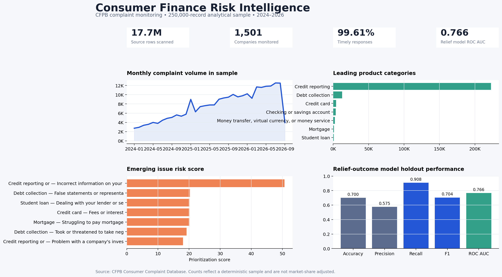
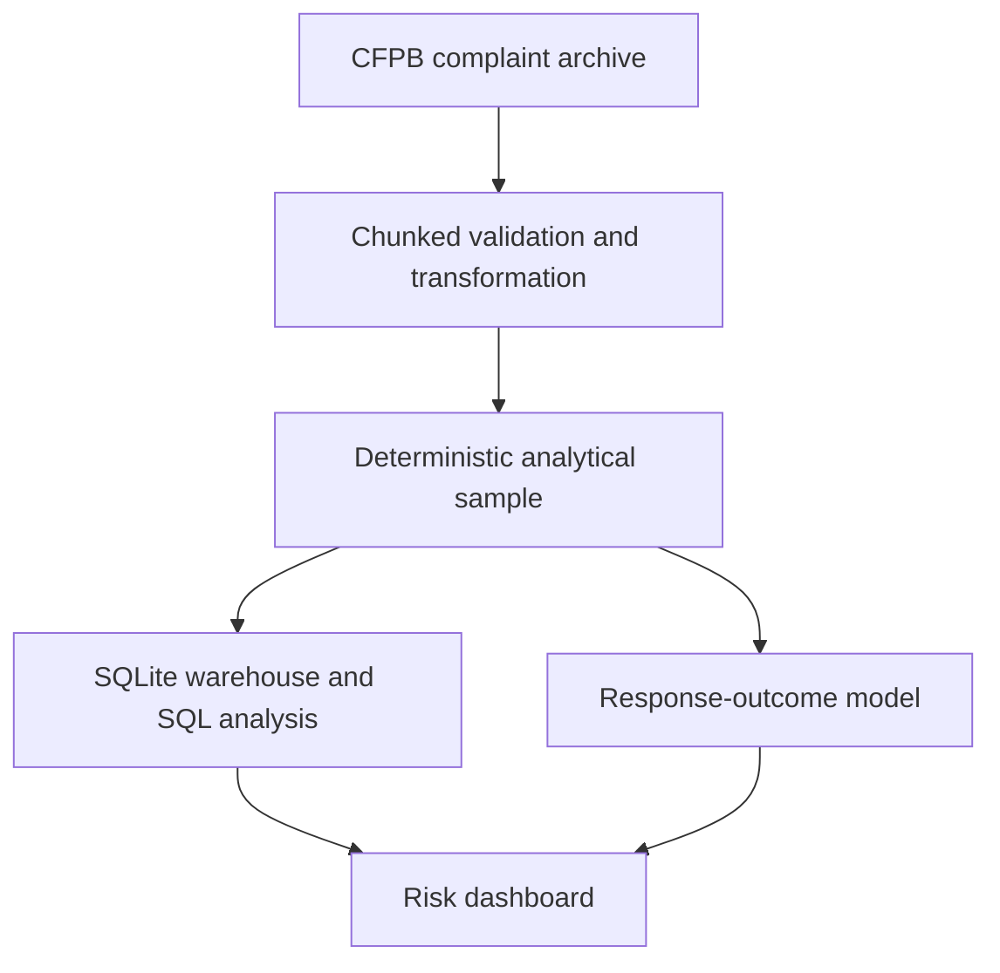

# Consumer Finance Risk Intelligence

An end-to-end analytics project that turns public consumer complaint data into operational risk signals and an explainable response-outcome model.



## Verified project snapshot

The reproducible run completed on September 15, 2026:

- Scanned **17,743,557** official CFPB source records and retained a deterministic **250,000-record** analytical sample covering January 2024 through September 14, 2026.
- Created a SQLite warehouse spanning **1,501 companies** and **11 financial product categories**.
- Trained the relief-outcome model on **120,000 records** and evaluated it on a **30,000-record** stratified holdout set.
- Achieved **0.766 ROC AUC**, **0.704 F1**, and **90.8% recall** for complaints receiving monetary or non-monetary relief.

The project answers three practical questions for a financial-services risk or operations team:

1. Which products, issues, companies, and states drive complaint volume?
2. Which product-issue combinations show unusual recent growth or response risk?
3. Can intake-time complaint attributes help forecast whether a closed complaint receives monetary or non-monetary relief?

## Why this project stands out

- Processes the large CFPB archive in chunks instead of relying on a pre-cleaned Kaggle file.
- Builds a reproducible, order-independent sample and a queryable SQLite warehouse.
- Demonstrates SQL CTEs, window functions, operational KPIs, and explicit business guardrails.
- Trains an interpretable relief-outcome model and reports holdout ROC AUC, precision, recall, and F1.
- Connects analysis to a usable Streamlit dashboard and interview-ready documentation.

## Architecture



## Repository structure

```text
.
├── app.py                         # Streamlit decision dashboard
├── data/                          # Raw and processed files are gitignored
├── docs/
│   ├── interview_guide.md         # Project explanation and likely questions
│   └── methodology.md             # Sampling, scoring, modeling, limitations
├── models/                        # Trained model artifact is gitignored
├── outputs/                       # Profiles, KPIs, risk table, model results
├── sql/analysis.sql               # Reusable business queries
├── src/cfri/
│   ├── analytics.py               # SQL aggregates and risk scoring
│   ├── config.py                  # Paths and project defaults
│   ├── download.py                # Official source download
│   ├── model.py                   # Explainable response classifier
│   └── pipeline.py                # Validation, features, sampling, warehouse
└── tests/test_pipeline.py         # Transformation and sampling tests
```

## Quick start

Python 3.10 or newer is recommended.

```bash
git clone https://github.com/jskjames/consumer-finance-risk-intelligence.git
cd consumer-finance-risk-intelligence
python -m venv .venv
source .venv/bin/activate              # Windows: .venv\Scripts\activate
python -m pip install -r requirements.txt
make all
streamlit run app.py
```

The default pipeline scans complaints received on or after January 1, 2024 and retains a deterministic sample of up to 250,000 records. To change the scope:

```bash
PYTHONPATH=src python -m cfri.pipeline --start-date 2023-01-01 --max-rows 500000
```

Run automated checks with:

```bash
make test
```

## Analytical outputs

After `make all`, the project creates:

| Output | Business use |
|---|---|
| `outputs/data_profile.json` | Auditable row counts, date coverage, and data-quality statistics |
| `outputs/emerging_risks.csv` | Prioritized product-issue combinations based on volume, growth, and timeliness |
| `outputs/company_response_scorecard.csv` | High-volume company response patterns with minimum-volume guardrails |
| `outputs/monthly_product_trends.csv` | Monthly complaint and timeliness trends by product |
| `outputs/model_metrics.json` | Holdout ROC AUC, precision, recall, F1, and accuracy |
| `outputs/top_model_features.csv` | Interpretable attributes associated with each response outcome |

## Modeling approach

The model uses complaint attributes available at intake—such as product, issue, company, state, and submission channel—to forecast whether a closed complaint receives monetary or non-monetary relief rather than an explanation alone. It combines one-hot encoded categorical features with class-weighted logistic regression. A stratified 20% holdout set measures generalization using ROC AUC and relief-class precision, recall, and F1.

This is a transparent operational baseline, not an autonomous decision system. See [the methodology](docs/methodology.md) for assumptions and limitations.

## Data ethics and limitations

The Consumer Financial Protection Bureau states that complaints are not a statistical sample of consumer experiences. Complaint counts are not adjusted for company size, customer exposure, or market share. Narratives reflect consumers' accounts and are published only after privacy review and consumer consent. The dashboard therefore supports investigation and prioritization; it does not rank company quality or estimate causality.

## Data source

Consumer Financial Protection Bureau, [Consumer Complaint Database](https://www.consumerfinance.gov/data-research/consumer-complaints/). The raw data is public and generally updated daily. Large source files, processed data, and trained model artifacts are excluded from Git.

## Author

Jaesung Kim  
Northeastern University — Data Science and Business Administration, concentrations in Data Science and Finance  
[LinkedIn](https://www.linkedin.com/in/jaesungkim0404)
